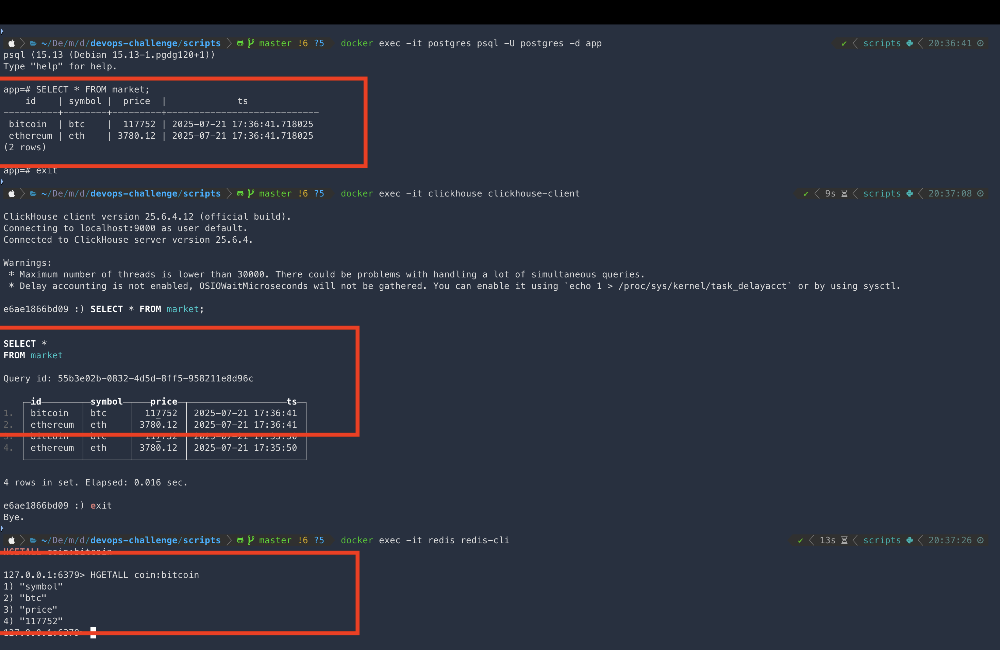

### Key Commands Used by CI:

```bash
terraform -chdir=${{ matrix.path }} fmt -check -recursive
terraform -chdir=${{ matrix.path }} init
terraform -chdir=${{ matrix.path }} validate
terraform -chdir=${{ matrix.path }} plan
terraform -chdir=${{ matrix.path }} apply -auto-approve

```
